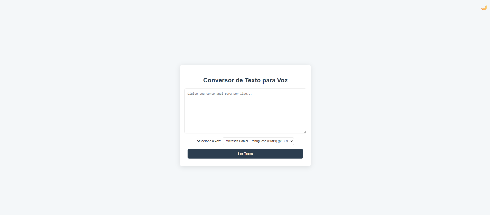
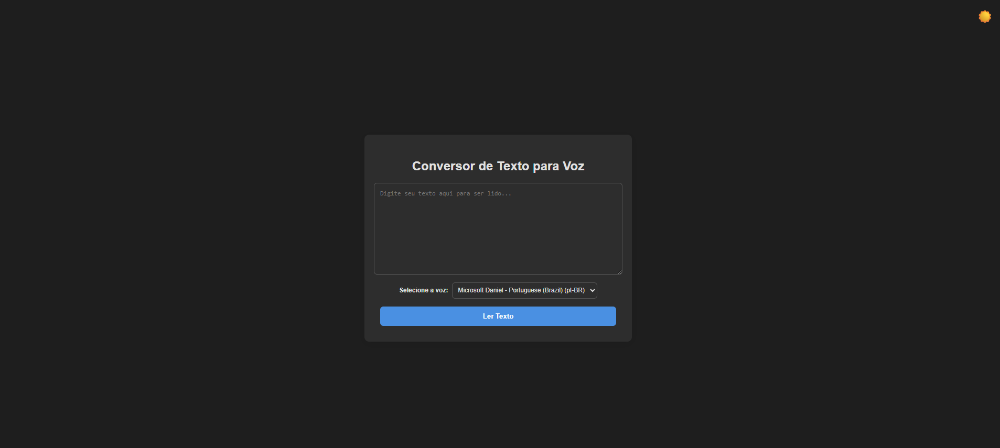

# Conversor de Texto para Voz

Este é um conversor de texto para voz simples, mas poderoso, construído com tecnologias web nativas. O projeto resolve o problema da acessibilidade para pessoas com deficiência visual ou dificuldades de leitura, transformando texto escrito em áudio com o clique de um botão.

## Tecnologias

- **Vanilla JavaScript**: Utilizado para toda a lógica da aplicação, sem a necessidade de frameworks ou bibliotecas externas.
- **Web Speech API**: Uma API nativa do navegador que fornece a funcionalidade de síntese de fala (Text-to-Speech), tornando o projeto leve e eficiente.
- **HTML5**: A base da estrutura da página.
- **CSS3**: Usado para estilizar a interface, incluindo o uso de **Variáveis CSS** para um sistema de tema diurno e noturno.

## Funcionalidades

- **Conversão de Texto para Áudio**: Converte qualquer texto digitado na área de texto em fala.
- **Seleção de Voz**: Popula dinamicamente uma lista de vozes disponíveis no navegador, permitindo ao usuário escolher a voz de sua preferência.
- **Modo Diurno e Noturno**: Um botão de alternância no canto superior direito permite ao usuário mudar para um tema escuro, com sua preferência salva no `localStorage` para persistência.
- **Interface Limpa e Intuitiva**: Um design minimalista que foca na funcionalidade principal do aplicativo.

## Como Executar o Projeto

Para rodar a aplicação localmente, basta abrir o arquivo `index.html` no seu navegador de preferência. Não é necessário instalar dependências ou usar um servidor local.

## Estrutura do Projeto

- **`index.html`**: A estrutura base da página, contendo a área de texto, a seleção de voz e os botões.
- **`style.css`**: Define a aparência de todos os elementos da página, incluindo a lógica de variáveis CSS para o tema diurno/noturno.
- **`script.js`**: Contém a lógica JavaScript que faz a conexão entre a interface e a Web Speech API. Ele também gerencia a persistência do tema e a alternância de ícones.

## Funcionalidades Futuras

O projeto pode ser expandido para incluir as seguintes funcionalidades:

1. **Controles de Áudio**: Adicionar botões para pausar, retomar e parar a leitura.
2. **Controle de Parâmetros**: Adicionar sliders para ajustar a taxa de velocidade (rate), o tom (pitch) e o volume da voz.
3. **Ícones SVG**: Substituir os ícones de texto (🌙 e ☀️) por ícones SVG mais profissionais para um visual mais refinado.

---

## Detalhe do projeto

**Projeto modo diurno**

**Projeto modo noturno**

